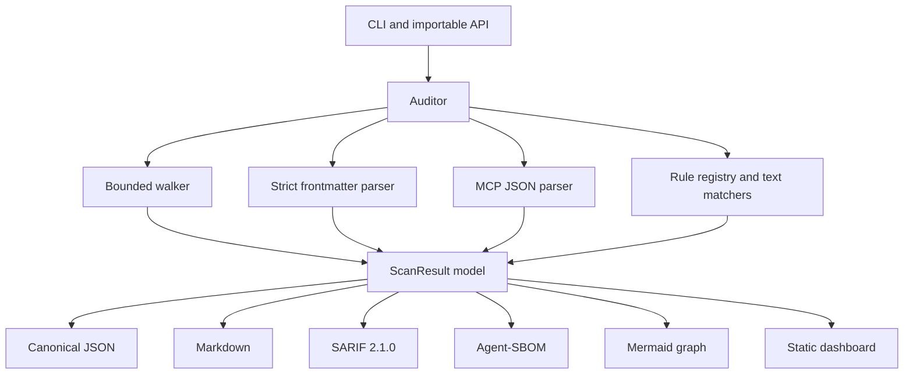
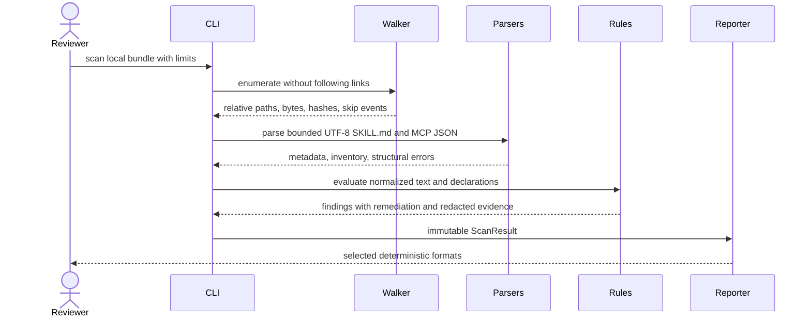

# Architecture

## Design Goals

1. Never import, execute, source, or resolve content from a scanned bundle.
2. Bound work before parsing untrusted bytes.
3. Produce stable evidence that is safe to commit or pass to CI.
4. Keep rules explicit and reviewable rather than hiding decisions in a model call.
5. Separate detection, normalized evidence, and presentation formats.

## Component View

## Processing Sequence

## Trust Boundaries

The local bundle root and every byte below it are untrusted. The walker uses `os.scandir`, tests
symlinks before file or directory checks, and never calls a resolver on a child entry. Inspection is
bounded by four independent limits:

| Limit | Default | Failure behaviour |
|---|---:|---|
| Files inventoried | 2,000 | Stop that traversal branch and emit `FSH003` |
| Bytes per file | 1 MiB | Hash is omitted, content is skipped, emit `FSH002` |
| Total bytes read | 20 MiB | Skip further content and emit `FSH003` |
| Directory depth | 20 | Do not descend and emit `FSH003` |

Unreadable or special entries are never coerced into ordinary files. Binary-looking or non-UTF-8
content is inventoried but not text-scanned.

## Parsing Model

`SKILL.md` uses a strict frontmatter subset: scalar mappings, nested mappings, and scalar lists. YAML
tags, anchors, aliases, duplicate keys, and ambiguous structures are rejected. This deliberately trades
YAML feature breadth for predictable security properties and zero runtime dependencies.

MCP files are identified by a known filename or the presence of `mcpServers`/`servers`. JSON values are
validated before inventory extraction. Environment **keys** may enter the inventory; environment
values never do.

## Finding Model

Each finding records:

- stable rule ID and title;
- severity and confidence as separate concepts;
- reviewer-facing message and remediation;
- relative file path and optional line number;
- capped, normalized, redacted evidence; and
- one-way evidence and finding fingerprints.

Findings sort by severity, rule ID, path, line, and ID. Duplicate IDs collapse before output.

## Determinism

The scan ID is SHA-256 over sorted file inventory, configured limits, and scanner version. Reports do
not include wall-clock time, hostnames, usernames, temporary paths, or filesystem modification times.
Two scans of unchanged bytes under unchanged limits therefore render byte-identical outputs. This is
enforced by `scripts/check_report_determinism.py`.

## Redaction

Credential-shaped substrings are replaced before evidence leaves the scanner. The neutral marker
contains only the first 12 hexadecimal characters of a SHA-256 digest; it deliberately omits the secret
shape so a marker cannot be reinterpreted as another credential. Reports can correlate repeat
observations without retaining the value. File hashes remain in the SBOM because they hash full files,
not extracted credential values; users should still decide whether publishing the hash of a private
file is appropriate.

## Extension Points

New rules belong in `rules.py` and must include a labelled fixture, a focused unit test, severity,
confidence, explanation, remediation, and false-positive analysis. Reporters consume only `ScanResult`;
they must not re-open bundle files or reinterpret evidence.
