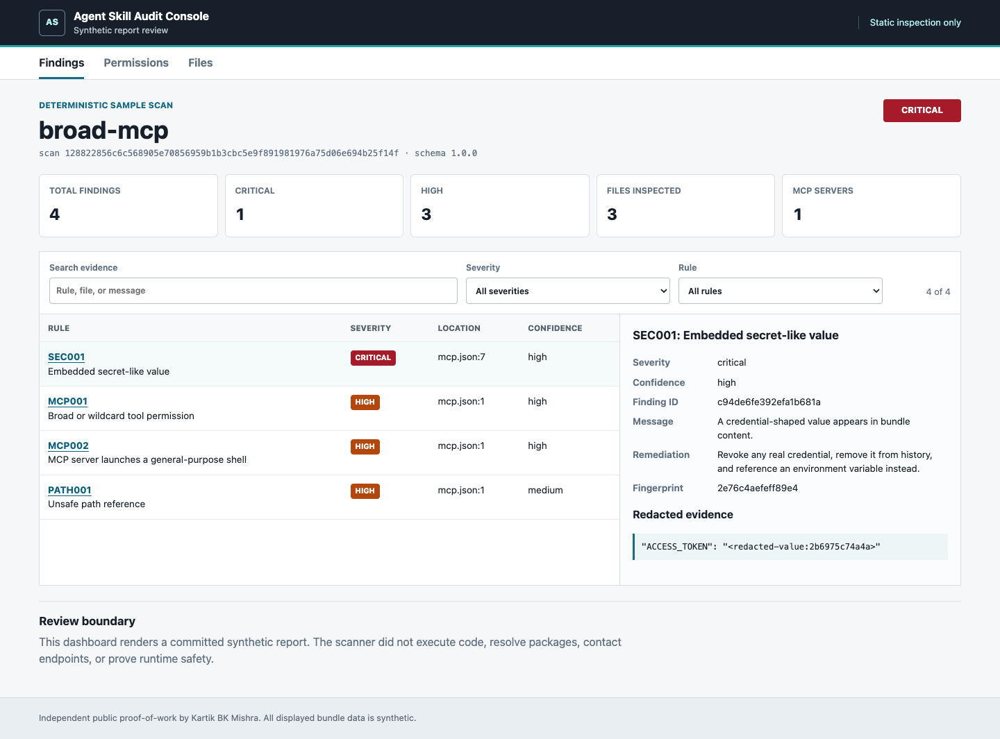
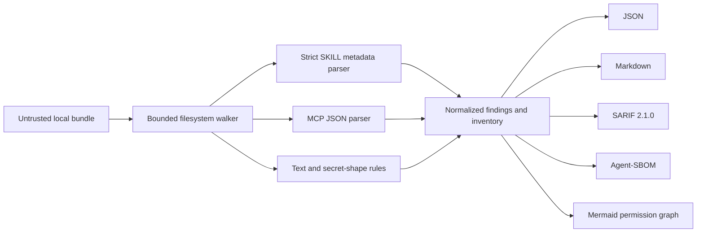

# Agent Skill Supply-Chain Auditor

Static, deterministic inspection for Agent Skill bundles and Model Context Protocol (MCP)
configurations. The auditor identifies risky instructions, credential shapes, unsafe shell guidance,
floating dependencies, broad tool grants, filesystem hazards, and missing governance without importing
or executing the inspected code.

> **Independent and synthetic:** Kartik BK Mishra designed this public proof-of-work project
> independently. It is not client work, a malware verdict, or evidence of production deployment. All
> committed test bundles, credentials, organizations, endpoints, and benchmark labels are synthetic.

## What This Demonstrates

| Engineering concern | Implemented evidence |
|---|---|
| Hostile-input handling | Bounded traversal, UTF-8 decoding, no symlink following, no dynamic imports |
| Agent security review | 17 rules for prompt, command, dependency, MCP, path, secret, and governance risks |
| Reproducibility | Content-derived scan IDs and byte-stable JSON, Markdown, SARIF, SBOM, and Mermaid outputs |
| Secure reporting | Relative paths, one-way evidence fingerprints, credential-value redaction |
| Evaluation discipline | 10 labelled synthetic fixtures with measured rule-level precision and recall |
| Product delivery | Importable Python API, CLI, CI policy exit codes, static review dashboard, Docker image |



## Problem

Agent bundles can mix natural-language instructions, executable helpers, dependency references, and MCP
permissions. A reviewer needs a quick answer to four questions before deciding whether to run one:

1. What files, tools, servers, environment keys, and remote references does it declare?
2. Do its instructions ask an agent to bypass approval, conceal behaviour, or expose protected data?
3. Can its install or process configuration expand the execution boundary unexpectedly?
4. Is there enough provenance and licensing information for an informed adoption decision?

This repository supplies pre-execution evidence for that review. It does not replace sandboxing, code
review, dependency verification, or runtime monitoring.

## Architecture



The scanner performs no network requests, package resolution, module imports, subprocess calls, or
template evaluation. See [ARCHITECTURE.md](ARCHITECTURE.md) and [THREAT_MODEL.md](THREAT_MODEL.md).

## Quick Start

Python 3.11 or newer is required. Runtime dependencies: **zero**.

```bash
python3 -m venv .venv
. .venv/bin/activate
python -m pip install -r requirements-dev.txt -e .
skill-auditor scan fixtures/safe/minimal-skill --output-dir reports/local
```

Inspect the intentionally vulnerable sample without making the finding threshold fail the command:

```bash
skill-auditor scan fixtures/vulnerable/broad-mcp \
  --output-dir reports/local/broad-mcp \
  --format all \
  --fail-on none
```

Verified sample summary:

```text
findings=4 highest=critical files=3
```

The four unique rules are `SEC001`, `MCP001`, `MCP002`, and `PATH001`. The credential-shaped fixture
value is absent from every generated report.

## CLI Contract

```text
skill-auditor scan TARGET [--output-dir DIR]
  [--format all|json|markdown|sarif|sbom|graph]
  [--fail-on none|low|medium|high|critical]
  [--max-file-bytes N] [--max-total-bytes N]
  [--max-files N] [--max-depth N]
```

Exit codes:

| Code | Meaning |
|---:|---|
| `0` | Scan completed and no finding met the selected threshold |
| `1` | Scan completed and at least one finding met the threshold |
| `2` | Invalid arguments, target, limits, or output operation |

The default threshold is `high`. Repeat `--format` to select several formats, or use `--format all`.

## Reports

| Output | File | Intended consumer |
|---|---|---|
| Canonical JSON | `scan-report.json` | Automation and downstream policy |
| Review Markdown | `scan-report.md` | Maintainers and security reviewers |
| SARIF 2.1.0 | `scan-report.sarif` | GitHub code scanning and SARIF tooling |
| Agent-SBOM | `agent-sbom.json` | File, dependency, permission, and MCP inventory |
| Mermaid graph | `permission-graph.mmd` | Human-readable capability relationships |

Schemas live in [`schemas/`](schemas/). All formats omit wall-clock timestamps and absolute machine
paths so unchanged input bytes and limits produce unchanged output bytes.

## Python API

```python
from pathlib import Path

from skill_auditor import ScanOptions, scan_path

result = scan_path(
    Path("my-agent-skill"),
    ScanOptions(max_files=500, max_total_bytes=10_000_000),
)

for finding in result.findings:
    print(finding.rule_id, finding.severity, finding.evidence.path)
```

The API retains no absolute scan-root path. Evidence snippets are normalized, capped, and redacted.

## Rule Coverage

The catalogue covers:

- invalid or missing `SKILL.md` metadata;
- suspicious policy override, concealment, and exfiltration language;
- common credential shapes and secret assignments;
- remote content piped into a shell;
- destructive or privilege-expanding commands;
- floating package and remote references;
- wildcard MCP or Agent Skill tool permissions;
- shell-backed and malformed MCP server declarations;
- unsafe paths, symlinks, oversized files, and exhausted inspection budgets;
- absent provenance or licensing; and
- non-loopback MCP endpoints using plain HTTP.

Every result includes severity, confidence, remediation, redacted evidence, and a deterministic finding
ID. Read the exact matching boundaries in [docs/rule-catalog.md](docs/rule-catalog.md).

## Measured Synthetic Evaluation

`make benchmark` scans the committed labelled corpus and calculates actual rule-level metrics:

| Fixtures | Positive rule labels | TP | FP | FN | Precision | Recall | F1 |
|---:|---:|---:|---:|---:|---:|---:|---:|
| 10 | 14 | 14 | 0 | 0 | 1.0000 | 1.0000 | 1.0000 |

These values apply **only** to the small synthetic corpus co-developed with the rules. They do not
estimate performance on unknown repositories. The generated evidence is in
[`reports/evaluation/`](reports/evaluation/), with limitations documented in
[docs/methodology.md](docs/methodology.md).

## Static Dashboard

```bash
python -m http.server 8080 --directory dashboard
```

Open `http://127.0.0.1:8080`. Findings, Permissions, and Files are live views over the committed,
redacted sample report. All filters and finding-selection controls are functional.

## Quality Gates

```bash
make lint       # Ruff checks and format verification
make compile    # Python bytecode compilation
make test       # Unit, integration, and negative tests
make sample     # Regenerate all five sample outputs and dashboard data
make benchmark  # Measure the labelled synthetic corpus
make verify     # Run every gate plus determinism and repository secret checks
```

GitHub Actions runs the same gates on Python 3.11, 3.12, and 3.13. The workflow never executes scripts
inside a scanned fixture.

## Repository Map

```text
src/skill_auditor/       Scanner, parsers, models, reporters, CLI, benchmark
tests/                   Unit, integration, hostile-input, and CLI tests
fixtures/                Labelled safe and intentionally vulnerable synthetic bundles
reports/                 Generated sample and evaluation evidence
dashboard/               Dependency-free report review interface
schemas/                 JSON Schema contracts
docs/                    Methodology, rule catalogue, review examples, screenshot
scripts/                 Evaluation, determinism, and secret-check entry points
.github/workflows/       Multi-version quality and CodeQL workflows
```

The exact tracked-file inventory is recorded in [`FILE_MANIFEST.txt`](FILE_MANIFEST.txt).

## Recruiter Walkthrough

A useful five-minute review path:

1. Read the trust boundary in [THREAT_MODEL.md](THREAT_MODEL.md).
2. Compare the safe and vulnerable bundles in [`fixtures/`](fixtures/).
3. Inspect the redacted [sample report](reports/sample/scan-report.md) and
   [permission graph](reports/sample/permission-graph.mmd).
4. Review the scanner orchestration in
   [`src/skill_auditor/scanner.py`](src/skill_auditor/scanner.py).
5. Check the measured [benchmark report](reports/evaluation/benchmark-results.md) and tests.

## Security and Limitations

- Pattern matching can produce false positives and false negatives.
- Natural-language intent is contextual; `INJ001` is a review signal, not a proof of malice.
- The strict frontmatter parser supports the conservative Agent Skill metadata subset, not arbitrary
  YAML features.
- Static inspection cannot observe runtime downloads, generated commands, transitive dependencies,
  endpoint behaviour, or vulnerabilities hidden by encoding or obfuscation.
- SARIF generation does not upload data. The operator controls any later upload.
- The process is not a hardened sandbox. Do not run unknown code beside or after a scan without an
  appropriate isolation boundary.
- Scan an immutable checkout or read-only snapshot; concurrent directory mutation is outside the threat
  model.

See [SECURITY.md](SECURITY.md) for reporting and [ROADMAP.md](ROADMAP.md) for carefully scoped future
work.

## License

Apache License 2.0. See [LICENSE](LICENSE).
