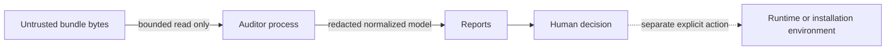

# Threat Model

## Scope

The auditor helps a human review a local Agent Skill bundle or MCP configuration before execution. Its
security property is narrow: inspection itself must not execute bundle code, cross filesystem
boundaries through links, or disclose credential-shaped evidence in reports.

## Assets

- Reviewer workstation files outside the selected bundle
- Credentials present in configuration or text
- Integrity of findings, scan IDs, and generated reports
- Availability of the inspection process
- Trust decisions made from the report

## Adversary Capabilities

Assume a bundle author can control names, directory depth, file count, file size, text, JSON, metadata,
symlinks, malformed encoding, shell snippets, and deceptive natural-language instructions. The author
may try to exhaust resources, escape the root, conceal a dangerous action, trigger code execution, or
place a credential-shaped value into a report.

The auditor does not assume an attacker can modify the installed auditor package, Python interpreter,
operating system, or report after generation. Concurrent mutation of the selected directory is outside
the guarantee; reviewers should scan an immutable checkout or read-only snapshot.

## Trust Boundaries

The dotted edge is intentionally outside this project. A clean scan never authorizes execution.

## Threats and Mitigations

| Threat | Mitigation | Residual risk |
|---|---|---|
| Script runs during inspection | No imports, subprocesses, eval, package resolution, or plugin loading | Compromised Python/runtime is out of scope |
| Symlink escapes bundle root | Symlinks are recorded, flagged, and never followed | Other filesystem indirection types may vary by OS |
| File or directory exhaustion | Independent size, count, total-byte, and depth limits | Many tiny directory entries still consume bounded CPU |
| Secret leaks into report | Shape matching, irreversible redaction, evidence caps, no env values in inventory | Unknown secret formats can evade patterns |
| Host paths leak | All evidence and inventory paths are bundle-relative | User-provided output directory appears only in CLI console output |
| Malformed metadata triggers unsafe parser behaviour | Zero-dependency strict subset; YAML tags, aliases, anchors rejected | Valid but unsupported YAML yields review findings |
| MCP wildcard hides excessive authority | Explicit permission inventory and wildcard rule | Semantic breadth of custom tools needs human review |
| Remote installer changes after review | Floating-reference and remote-shell rules | Pinned artifacts can still be malicious |
| Report is treated as a safety certificate | Every format includes a static-only limitation | Downstream consumers can remove warnings |
| Synthetic benchmark is overstated | Corpus scope and co-development limitation appear beside metrics | Readers may still quote metrics without context |

## Abuse Cases Deliberately Avoided

The repository contains no exploit payloads, live tokens, remote targets, credential validators, malware
signatures, or code that executes third-party bundles. Vulnerable fixtures are inert strings and JSON.

## Out of Scope

- Runtime containment or sandboxing
- Malware classification
- Dependency download or vulnerability resolution
- Network endpoint verification
- Semantic proof that an instruction is malicious
- Obfuscated, encrypted, compressed, generated, or non-UTF-8 payload analysis
- Authenticating the claimed author or license holder
- Protecting reports after they leave the process

## Security Invariants

1. A scanned file is never imported or executed.
2. A symbolic link target is never opened.
3. No absolute target path appears in a `ScanResult`.
4. Environment values are absent from the Agent-SBOM and permission graph.
5. Known credential shapes are redacted before reporter invocation.
6. The same bytes and limits produce the same scan ID and report bytes.

Tests directly exercise each invariant that can be verified on the local platform.
